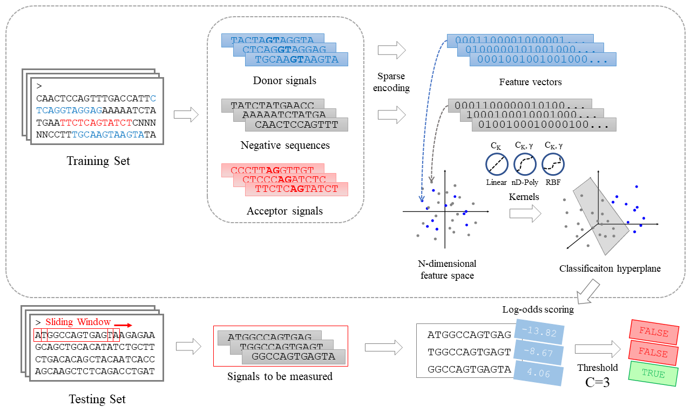

# SplicePredictor

:octocat: ​A task of functional sites finding in genetic DNA. 

## Overview

This is a re-implementation of predicting donor & acceptor splice site signals using 3 different models. 

### Weight Array (WAM)

An optimized frequency-based method to predict splice site patterns with the weight array model. At bottom, a weight array method continues to extract splice signals, count the frequencies of nucleotides and fill the matrices, identical with the conditional weight matrices (WMM). What we can use to distinguish WAM from WMM is that WAM takes into account the correspondence between current position and an adjoining position, which we certify conducive to promote accuracy of splice site prediction. See [Zhang et al. (1993)](https://academic.oup.com/bioinformatics/article-abstract/9/5/499/349215?redirectedFrom=fulltext) for a reference. 

*Overall architecture of the WAM splice predictor. (Framework pictures made by hand)*

### Bayesian Network (BN)

A probabilistic graphical model which considers long range interdependency among nucleotide sequences by learning a direct acyclic graph (DAG), finding all of the conditional probabilities for each of the variables which will be used to search for missing labels of the testing sequences. See [Chen et al. (2005)](https://academic.oup.com/bioinformatics/article/21/4/471/203185?login=true) for a reference. BNs are implemented using [Pgmpy](http://pgmpy.org/) and [NetworkX](https://networkx.org/). 

*Overall architecture of the Bayesian network splice predictor.*

### Support Vector Machine (SVM)

A discriminant analysis method to predict splice site patterns, the principle of which is to map samples linear-inseparable in the primal n-dimension feature space to a higher dimension feature space where they become linear-separable by mathematical transformations. See [Chen et al. (2005)](https://academic.oup.com/bioinformatics/article/21/4/471/203185?login=true) for a reference. SVMs are implemented using [Scikit-Learn](https://scikit-learn.org/stable/) based on [LibSVM](https://www.csie.ntu.edu.tw/~cjlin/libsvm/). [Thundersvm](https://thundersvm.readthedocs.io/en/latest/) is recommended as a substitute for `sklearn.svm` to support GPU training. 

*Overall architecture of the support vector machine splice predictor.*

For details, see `./Docs`. 

## Quick Start

To **train a model** and **evaluate with a set threshold**, just run `wam.py`, `bn.py` or `svm.py` in `./Model`:

~~~bash
$ python wam.py
~~~

A `.model` file will be saved in `./Model/donor` or `./Model/acceptor` accordingly based on the site type you prefer. 

Then, you may **get plotting** by your trained model in `./Utils`:

~~~bash
$ python plot.py # You may set the model types in plot.py first
~~~

You may check `./Pics` for Precision - Recall curves and ROC curves. In addition, a `.csv` file is also saved in `./Model/donor` or `./Model/acceptor` containing the metric plots for data inspection and figure adjustment. You can just load these csv files simply by setting `load_csv=True` in `Plot.plot()` which spares a large amount of time of repetitive and monotonous predicting tasks. 

For more examples and instructions, just see the source code. 

## Acknowledgment

This work was supported by Professor Zhou from College of Life Science \& Technology, Huazhong University of Science and Technology, and Wuhan National Laboratory for Optoelectronics for providing computing resources. Also acknowledge our classmates for helpful suggestions \& corrections. 

WARNING: This code is not encapsulated well by far. More reconfiguration & maintenance tasks on the way:tired_face:... 

This project is welcome for perfection of contributors. :heart:

## Citing

Please use the following bibtex for citing my work in your research: 

~~~tex
% for Weight Array Model
@article{newiz2021wam,
  title={WAM: A Weight Array Model for Prediction of Eukaryotic Genetic Splice Sites},
  author={Ziwen Zhao},
  journal={Bioinformatics: Data Mining Report},
  year={2021}
}
% for Bayesian Network
@article{newiz2021bn,
  title={Bayesian Network: A Bayesian Statistics Based Probabilistic Graphical Model for Prediction of Eukaryotic Genetic Splice Sites},
  author={Ziwen Zhao},
  journal={Specialty Innovation and Entrepreneurship Training for Bioinformatics},
  year={2021}
}
% for Support Vector Machine
@article{newiz2021svm,
  title={A Support Vector Machine Method for Prediction of Eukaryotic Genetic Splice Sites},
  author={Ziwen Zhao},
  journal={Bioinformatics: Data Mining Report},
  year={2021}
}
~~~

## Contact

Reach me via E-mail: justn582@gmail.com for a conversation. :laughing:

> 2021 By Newiz

